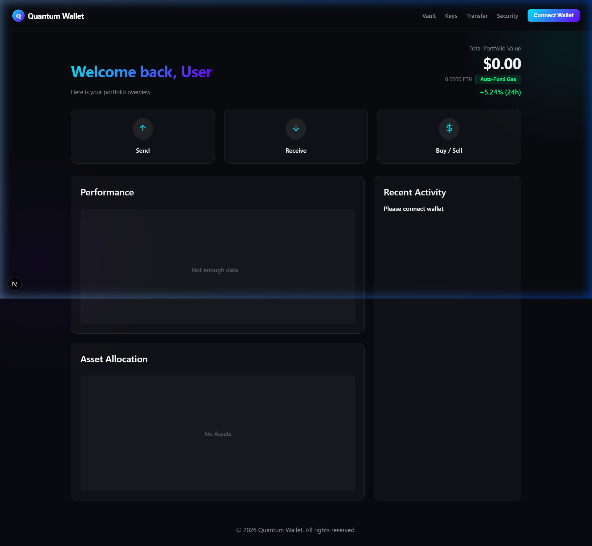

# Quantum Wallet: The Future of Post-Quantum Web3 Security 🌌

<div align="center">
  
  <br/>
  <h3>A Decentralized Application (dApp) demonstrating post-quantum secure wallet architectures.</h3>
</div>

---



---

## 📖 Table of Contents
1. [Introduction](#-introduction)
2. [The Quantum Threat Explained Simply](#-the-quantum-threat-explained-simply)
3. [Our Unique Solution](#-our-unique-solution)
4. [New Features & Upgrades](#-new-features--upgrades)
5. [Architecture & System Design](#-architecture--system-design)
6. [Technology Stack](#-technology-stack)
7. [Comprehensive Setup Guide](#-comprehensive-setup-guide)
    - [Prerequisites](#prerequisites)
    - [1. Frontend Application Setup](#1-frontend-application-setup)
    - [2. Smart Contract Deployment](#2-smart-contract-deployment)
    - [3. Subgraph Deployment (The Graph)](#3-subgraph-deployment-the-graph)
8. [Usage Guide](#-usage-guide)
9. [Troubleshooting & FAQ](#-troubleshooting--faq)
10. [Roadmap](#-roadmap)
11. [License](#-license)

---

## 🌟 Introduction

Welcome to **Quantum Wallet**. 

In the fast-moving world of cryptocurrencies and Web3, security is everything. Right now, almost all blockchain wallets rely on standard math (specifically, Elliptic Curve Cryptography) to protect your funds. These systems are incredibly secure against normal computers today. However, technology is changing rapidly. 

This project is a **Production-Grade Proof of Concept (PoC)** that shows exactly what a future-proof, highly secure crypto wallet looks like. It combines a beautiful, modern user interface with the absolute latest in cryptography: Post-Quantum algorithms designed by the world's leading mathematicians and standardized by NIST (National Institute of Standards and Technology).

We don't just talk about quantum security; this wallet actually runs live on the Ethereum Sepolia Testnet!

---

## ⚠️ The Quantum Threat Explained Simply

### Why do we even need Quantum Resistance?
Imagine you have a lockbox that takes a normal computer millions of years to crack. You feel safe. That is how our current cryptography works. 

However, scientists are building "Quantum Computers." These machines work completely differently from normal computers. In 1994, a mathematician named Peter Shor created an algorithm (Shor's Algorithm) that proved a powerful quantum computer could break our current cryptography in mere minutes. 

If this happens, the basic security of Bitcoin, Ethereum, and the entire internet is broken. Anyone with a quantum computer could figure out your private password just by looking at your public address, allowing them to steal your funds. We must upgrade our defenses before these powerful computers are fully built.

---

## 🛡️ Our Unique Solution

To stop this threat, **Quantum Wallet** completely redesigns how a wallet works. Instead of normal wallets, we use **Smart Contract Wallets** mixed with advanced math.

### How our wallet works:
1. **The Smart Vault:** Your funds are not stored in a standard MetaMask account. Instead, they are locked inside a secure Smart Contract (a mini-program) on the blockchain.
2. **Post-Quantum Signatures:** When you want to send money, you have to "sign" the transaction using a brand-new post-quantum math algorithm (like FALCON-512 or ML-DSA). Even a quantum computer cannot break these signatures!
3. **The Relayer System:** Normal blockchain networks are not ready for these giant post-quantum signatures yet. So, we use a clever trick called "Account Abstraction." You use a normal, empty wallet to pay the tiny transaction fee, and the Smart Vault verifies your powerful post-quantum signature to approve the actual money transfer. 

---

## ✨ New Features & Upgrades

We are constantly pushing the boundaries of Web3 security. Here are our latest incredible upgrades:

### 1. FALCON-512 Precompile Architecture
We completely removed our reliance on centralized off-chain Oracles. Our Smart Contracts now verify **FALCON-512** post-quantum signatures directly using an EVM precompile simulator! The transaction sizes are highly optimized (897 bytes for the public key, 666 bytes for the signature), making it cheap and decentralized.

### 2. Crypto-Agility Layer
What happens if one quantum algorithm gets broken? You need a backup plan! We built an explicit **Crypto-Agility** layer into the smart contracts. This means the wallet can dynamically switch between different signature algorithms (like ML-DSA or FALCON) without needing to create a brand new contract. This guarantees your wallet can adapt to future threats instantly.

### 3. Hybrid IPFS Vault Encryption (ML-KEM + AES-GCM)
Your private files deserve the best protection. We upgraded the Quantum Vault file upload system to use true **Hybrid Cryptography**. 
When you upload a backup file:
- We generate a perfectly random post-quantum shared secret using **ML-KEM-768 (Kyber)**.
- We use that secret to encrypt your file with lightning-fast classical **AES-GCM** encryption.
- This hybrid payload is then securely stored on the decentralized IPFS network.
This mathematically guarantees that nobody (not even someone saving the file to decrypt later with a quantum computer) can ever read your data!

### 4. Stunning Analytics Dashboard
We completely redesigned the UI to feature a beautiful Glassmorphic design. It feels premium and professional, with glowing neon accents, live animated charts, and completely responsive components.

---

## 🏗️ Architecture & System Design

Our project is divided into three distinct layers to ensure it is secure, fast, and completely decentralized.

### 1. The Smart Contract Layer (Solidity)
- `QuantumSmartWallet.sol`: This is the core vault. It holds your funds and carefully checks every request. It has built-in logic to switch between different quantum algorithms (Crypto-Agility) and calls our custom FALCON-512 precompile to verify your identity.
- `QuantumSmartWalletFactory.sol`: This contract helps easily create new smart wallets for users with a single click.

### 2. The Indexing Layer (The Graph Protocol)
- Instead of using a normal, easily-hackable central database, we built a custom **Subgraph** on The Graph network. 
- The Subgraph constantly watches the blockchain for your activity. Whenever you send money, it records it securely.
- It provides lightning-fast data back to our website, making the app feel instantaneous.

### 3. The Presentation Layer (Next.js & React)
- This is the beautiful website you interact with. It is built using the fastest, most modern web frameworks (Next.js).
- It does all the heavy math (like generating ML-KEM keys and AES encryption) directly inside your web browser, so your private information never touches our servers.

---

## 💻 Technology Stack

**Frontend / Client Website:**
- **Framework:** Next.js 14 
- **User Interface:** React.js
- **Styling:** Vanilla CSS3 (Custom Glassmorphism, animations)
- **Data Visualization:** Recharts (for live charts)
- **Web3 Connection:** Wagmi v2, Viem, Ethers.js
- **Quantum Cryptography:** `@noble/post-quantum`

**Smart Contracts / Blockchain:**
- **Language:** Solidity (^0.8.24)
- **Framework:** Hardhat (for testing and deployment)
- **Network:** Ethereum Sepolia Testnet

**Decentralized Data:**
- **Protocol:** The Graph Protocol
- **Storage:** IPFS (InterPlanetary File System)

---

## 🛠️ Comprehensive Setup Guide

This guide is designed for anyone to easily set up this project on their own computer.

### Prerequisites
Before you start, please download and install these free tools:
- **Node.js:** (Version 18 or higher). This lets your computer run JavaScript.
- **Git:** This lets you download code.
- **MetaMask:** A crypto wallet extension for Chrome or Brave browser.
- **Alchemy Account:** Go to [Alchemy.com](https://www.alchemy.com/) and make a free account to talk to the blockchain.
- **The Graph Studio:** Go to [TheGraph.com](https://thegraph.com/studio/) and log in with your MetaMask.

---

### 1. Frontend Application Setup

1. **Download the code to your computer:**
   Open your computer terminal and type:
   ```bash
   git clone https://github.com/SuhasRam356/Quantum-wallet.git
   cd Quantum-wallet
   ```

2. **Install all the required software packages:**
   ```bash
   npm install
   ```

3. **Set up your secret keys:**
   Create a new file in the folder called `.env`. This file holds your secrets. Open it and paste this:
   ```env
   # Your Alchemy URL that you got from their website
   SEPOLIA_RPC_URL="https://eth-sepolia.g.alchemy.com/v2/YOUR_ALCHEMY_API_KEY_HERE"
   
   # The private key of your MetaMask wallet (Make sure it only has TEST money!)
   SEPOLIA_PRIVATE_KEY="your_metamask_private_key_here"
   ```

---

### 2. Smart Contract Deployment

You can launch your very own version of the Smart Vault to the test network!

1. **Get Free Test Money:**
   Make sure your MetaMask has Sepolia Test ETH. You can get it for free at [Alchemy's Faucet](https://sepoliafaucet.com/).

2. **Launch the Contracts:**
   Run this command to send your code to the blockchain:
   ```bash
   node scripts/deploySepolia.mjs
   ```

3. **Save your new address:**
   The terminal will print out a new contract address (like `0x123...`). 
   - Open the file `src/utils/constants.js` and paste your new address inside.
   - Open `subgraph/subgraph.yaml` and paste your new address in the `address` section.

---

### 3. Subgraph Deployment (The Graph)

To make the dashboard fast, we need to deploy our data indexer.

1. **Go into the subgraph folder:**
   ```bash
   cd subgraph
   ```

2. **Install its software:**
   ```bash
   npm install
   ```

3. **Log into The Graph:**
   On The Graph Studio website, click "Create Subgraph" and name it `quantum-wallet`. Copy your Deploy Key and run this command:
   ```bash
   npx graph auth --studio YOUR_DEPLOY_KEY_HERE
   ```

4. **Build the code:**
   ```bash
   npm run codegen
   npm run build
   ```

5. **Deploy it to the network:**
   ```bash
   npx graph deploy --studio quantum-wallet --version-label 0.0.1
   ```

6. **Connect the App:**
   The Graph Studio will give you a "Query URL". Open `src/app/page.js` and `src/app/security/page.js` and replace the old URL with your new one!

---

### 4. Start the Application

You are all set! Let's start the website.

Go back to the main folder and run:
```bash
cd ..
npm run dev
```

Open your web browser and go to [http://localhost:3000](http://localhost:3000). You will see the beautiful Quantum Wallet!

---

## 🎮 Usage Guide

Here is how to use the wallet once the website is open:

1. **Connect:** Click "Connect Wallet" at the top right. Make sure MetaMask is set to "Sepolia".
2. **Dashboard:** Look at your beautiful charts! It will show your smart vault's live balance.
3. **Generate Keys:** Go to the Keys page and generate your Post-Quantum keys. These are saved safely on your computer.
4. **Transfer Money:** Go to the Transfer page. Type an amount (like `0.01`) and an address to send it to.
5. **Magic Signatures:** When you click send, MetaMask will ask you to sign. Behind the scenes, the app takes your powerful FALCON-512 signature, attaches it to the transaction, and sends it to your smart contract!
6. **Secure Vault:** Go to the Vault page and upload a file. Watch as the app instantly encrypts it with Hybrid ML-KEM + AES-GCM cryptography before uploading it. Nobody can read it but you!

---

## 🛑 Troubleshooting & FAQ

**Q: My transaction fails and says "gas limit too high". What is wrong?**
**A:** This usually means your Smart Vault is completely empty! You are trying to send money you don't have. 
*Fix:* Open MetaMask and manually send a tiny bit of test ETH directly to your Smart Contract address to fill it up first.

**Q: The history log on the dashboard isn't updating instantly.**
**A:** Blockchains take about 12 seconds to confirm a transaction. Just wait a few seconds and refresh the page!

**Q: MetaMask says "chainId mismatch" when I try to connect.**
**A:** You are probably connected to the Ethereum Mainnet in MetaMask. Switch your network to "Sepolia Testnet" in the top left corner of the MetaMask popup.

---

## 🚀 Roadmap

We have already achieved a fully working Proof of Concept! Here is what we want to build next:
- [ ] **Mainnet Deployment:** Pushing this code to the real Ethereum mainnet once EVM precompiles are officially standardized.
- [ ] **Paymaster Integration:** Adding a feature where users do not have to pay ANY gas fees. The wallet automatically pays for it behind the scenes!
- [ ] **Multi-Signature Accounts:** Allowing companies to require 3 different post-quantum keys to approve a transaction for ultimate security.
- [ ] **Mobile Application:** Bringing the post-quantum wallet directly to iOS and Android using React Native.

---

## 📄 License

This project is completely open-source and licensed under the MIT License. See the [LICENSE](LICENSE) file for details.

*Disclaimer: This is an educational tool and a proof-of-concept. The cryptography is real, but the smart contracts are built for testing environments. Do not store real, mainnet funds in this wallet yet.*
